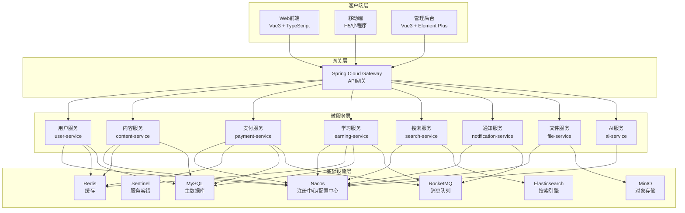
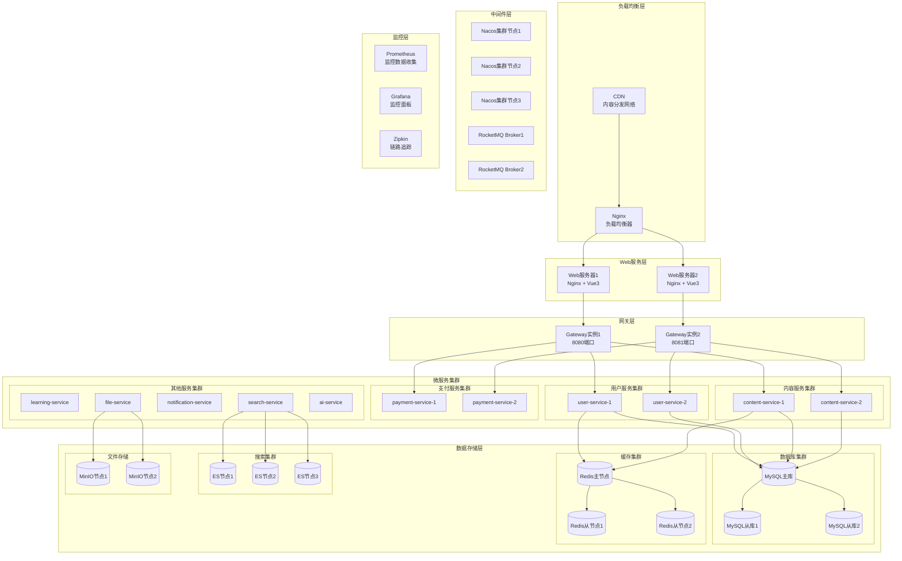
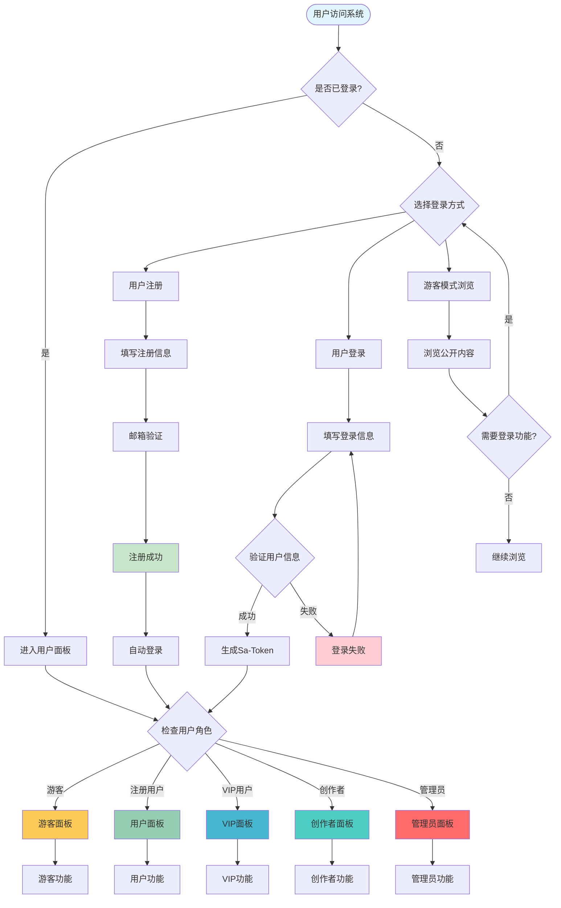
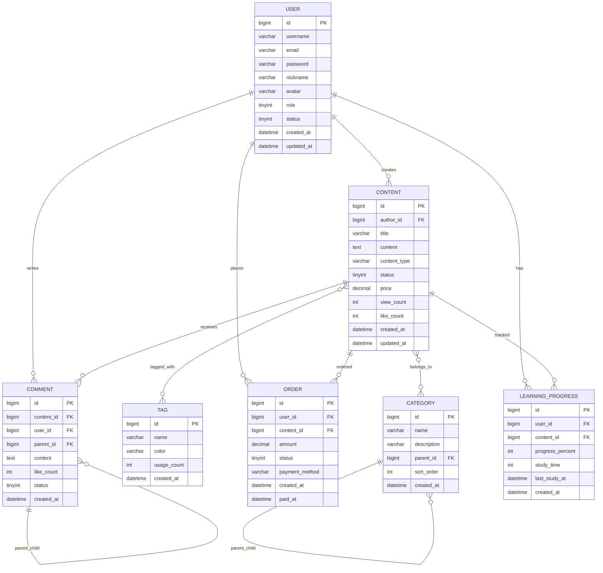
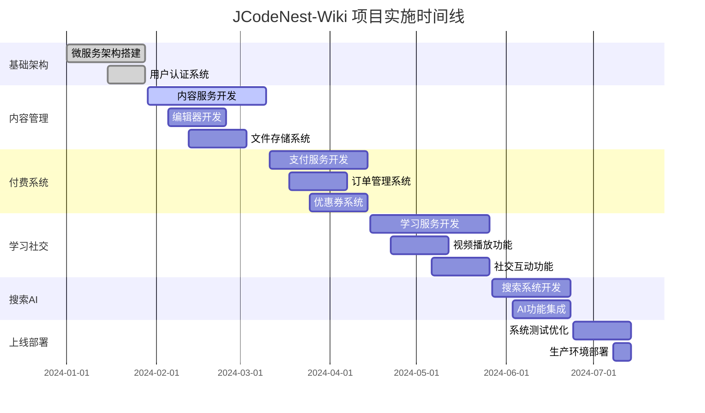

# JCodeNest-Wiki 需求文档

## 1. 项目概述

### 1.1 项目背景
JCodeNest-Wiki 是一个基于 SpringCloud 微服务架构的企业级知识管理平台，旨在为个人开发者、技术团队和教育机构提供一站式的知识创作、管理、分享和变现解决方案。

### 1.2 项目目标
- **知识管理**：提供高效的文档创作、编辑、版本控制和协作功能
- **内容变现**：支持多种付费模式，帮助内容创作者实现知识变现
- **学习体验**：打造沉浸式的在线学习环境，支持多媒体内容
- **社区生态**：构建活跃的技术社区，促进知识分享和交流
- **智能化**：集成AI能力，提供智能问答、内容推荐等功能

### 1.3 核心价值主张
- **多媒体支持**：文档、视频、音频、代码片段等多种内容形式
- **灵活付费**：单次购买、订阅制、积分制、优惠券等多元化商业模式
- **权限精细化**：支持文档级、章节级、标签级的权限控制
- **高性能渲染**：优化的 Markdown 渲染引擎，支持复杂文档结构
- **智能搜索**：全文检索、标签搜索、智能推荐等多维度搜索体验

### 1.4 项目范围
**包含功能：**
- 用户管理与权限控制
- 内容创作与管理
- 付费资源与订单管理
- 在线学习与进度跟踪
- 社交互动与社区功能
- 智能搜索与推荐

**不包含功能：**
- 第三方平台内容同步
- 线下培训管理
- 企业级单点登录集成（后续版本考虑）

## 2. 系统架构设计

### 2.1 微服务架构

系统采用 SpringCloud 微服务架构，按业务领域划分为8个核心服务：

**核心服务说明：**
- **用户服务（user-service）**：用户注册、登录、权限管理、用户画像
- **内容服务（content-service）**：文档管理、版本控制、分类标签、内容审核
- **支付服务（payment-service）**：订单管理、支付集成、优惠券、收益分成
- **学习服务（learning-service）**：课程管理、学习进度、考试系统、数据分析
- **搜索服务（search-service）**：全文检索、智能推荐、内容发现
- **通知服务（notification-service）**：消息推送、邮件通知、站内信
- **文件服务（file-service）**：文件上传、存储管理、CDN加速
- **AI服务（ai-service）**：智能问答、内容推荐、自动标签

### 2.2 技术选型

#### 2.2.1 后端技术栈
| 技术分类 | 技术选型 | 版本 | 说明 |
|---------|---------|------|------|
| 基础框架 | Spring Boot | 3.2.4 | 微服务基础框架 |
| 微服务框架 | Spring Cloud | 2023.0.1 | 微服务治理 |
| 阿里云组件 | Spring Cloud Alibaba | 2023.0.1.0 | 阿里云微服务组件 |
| 注册中心 | Nacos | 2.3.0 | 服务注册与配置管理 |
| 服务容错 | Sentinel | 1.8.6 | 流量控制与熔断降级 |
| 服务调用 | OpenFeign | 4.0.1 | 声明式服务调用 |
| 负载均衡 | Spring Cloud LoadBalancer | 4.0.1 | 客户端负载均衡 |
| API网关 | Spring Cloud Gateway | 4.0.1 | 统一网关入口 |
| 消息队列 | RocketMQ | 5.1.0 | 异步消息处理 |
| 分布式事务 | Seata | 1.7.0 | 分布式事务管理 |
| 数据库 | MySQL | 8.0 | 主数据库 |
| 缓存 | Redis | 7.0 | 分布式缓存 |
| 搜索引擎 | Elasticsearch | 8.8.0 | 全文检索 |
| 对象存储 | MinIO | RELEASE.2023-06-19 | 文件存储 |
| AI框架 | Spring AI | 0.8.1 | AI能力集成 |
| 链路追踪 | Micrometer Tracing + Zipkin | 1.2.0 | 分布式链路追踪 |
| 数据库连接池 | HikariCP | 5.0.1 | 高性能连接池 |
| ORM框架 | MyBatis Plus | 3.5.3 | 数据持久化 |
| 安全框架 | Spring Security + Sa-Token | 6.2.0 + 1.37.0 | 认证授权 |

#### 2.2.2 前端技术栈
| 技术分类 | 技术选型 | 版本 | 说明 |
|---------|---------|------|------|
| 前端框架 | Vue.js | 3.4.0 | 渐进式前端框架 |
| 开发语言 | TypeScript | 5.2.0 | 类型安全的JavaScript |
| 构建工具 | Vite | 5.0.0 | 快速构建工具 |
| UI组件库 | Element Plus | 2.4.0 | Vue3组件库 |
| 状态管理 | Pinia | 2.1.0 | Vue状态管理 |
| 路由管理 | Vue Router | 4.2.0 | 前端路由 |
| HTTP客户端 | Axios | 1.6.0 | HTTP请求库 |
| Markdown渲染 | @vueuse/markdown | 10.5.0 | Markdown渲染 |
| 代码高亮 | Prism.js | 1.29.0 | 代码语法高亮 |
| 图表库 | ECharts | 5.4.0 | 数据可视化 |
| 视频播放器 | Video.js | 8.6.0 | 视频播放组件 |

### 2.3 部署架构

系统采用容器化部署，支持Docker + Kubernetes编排，具备高可用、可扩展的部署能力：

**部署环境：**
- **开发环境**：单机Docker Compose部署，用于开发调试
- **测试环境**：Kubernetes集群部署，模拟生产环境
- **生产环境**：多节点Kubernetes集群，支持自动扩缩容

**高可用保障：**
- 负载均衡：Nginx + CDN实现流量分发
- 服务冗余：核心服务多实例部署
- 数据备份：MySQL主从复制 + Redis哨兵模式
- 监控告警：Prometheus + Grafana + 钉钉告警

## 3. 用户角色与权限设计

### 3.1 用户角色定义

| 角色类型 | 角色名称 | 角色描述 | 主要权限 |
|---------|---------|---------|---------|
| 游客 | Guest | 未注册用户 | 浏览免费内容、搜索、注册 |
| 注册用户 | User | 已注册的普通用户 | 创建内容、评论互动、购买资源 |
| VIP用户 | VIP | 付费会员用户 | 访问VIP内容、优先客服、专属功能 |
| 内容创作者 | Creator | 内容生产者 | 发布付费内容、查看收益、内容管理 |
| 管理员 | Admin | 系统管理员 | 用户管理、内容审核、系统配置 |

### 3.2 权限粒度设计

**文档级权限：**
- 公开文档：所有用户可访问
- 登录可见：注册用户可访问
- VIP专享：VIP用户及以上可访问
- 付费内容：购买后可访问
- 私有文档：创作者和授权用户可访问

**章节级权限：**
- 免费章节：所有用户可访问
- 试读章节：显示部分内容，引导付费
- 付费章节：购买后完整访问
- VIP章节：VIP用户专享内容

**标签级权限：**
- 公开标签：所有用户可见
- 会员标签：注册用户可见
- 专业标签：特定领域专家可见
- 内部标签：管理员和创作者可见

### 3.3 用户权限矩阵

详细的权限矩阵如下图所示，采用RBAC（基于角色的访问控制）模型，确保不同角色用户获得相应的功能权限。

```mermaid
graph TD
    subgraph "权限层级"
        Admin[管理员<br/>Admin]
        Creator[内容创作者<br/>Creator]
        VIP[VIP用户<br/>VIP User]
        User[注册用户<br/>Registered User]
        Guest[游客<br/>Guest]
    end

    subgraph "内容权限"
        PublicContent[公开内容<br/>Public Content]
        LoginContent[登录可见<br/>Login Required]
        VIPContent[VIP专享<br/>VIP Exclusive]
        PaidContent[付费内容<br/>Paid Content]
        PrivateContent[私有内容<br/>Private Content]
    end

    subgraph "功能权限"
        Browse[浏览内容<br/>Browse]
        Comment[评论互动<br/>Comment]
        Create[创建内容<br/>Create]
        Publish[发布付费内容<br/>Publish Paid]
        Manage[内容管理<br/>Content Management]
        UserMgmt[用户管理<br/>User Management]
        SystemConfig[系统配置<br/>System Config]
    end

    Admin --> PrivateContent
    Admin --> SystemConfig
    Admin --> UserMgmt
    Admin --> Manage
    Admin --> Publish
    Admin --> Create
    Admin --> Comment
    Admin --> Browse

    Creator --> PaidContent
    Creator --> Publish
    Creator --> Manage
    Creator --> Create
    Creator --> Comment
    Creator --> Browse

    VIP --> VIPContent
    VIP --> PaidContent
    VIP --> Create
    VIP --> Comment
    VIP --> Browse

    User --> LoginContent
    User --> PaidContent
    User --> Create
    User --> Comment
    User --> Browse

    Guest --> PublicContent
    Guest --> Browse

    style Admin fill:#ff6b6b
    style Creator fill:#4ecdc4
    style VIP fill:#45b7d1
    style User fill:#96ceb4
    style Guest fill:#feca57
```

### 3.4 用户流程设计

## 4. 功能需求详述

### 4.1 用户管理系统

#### 4.1.1 用户注册与认证
**功能描述：**
- 支持邮箱、手机号注册
- 邮箱验证激活账户
- 密码强度校验
- 图形验证码防刷
- 第三方登录集成（微信、QQ、GitHub）

**技术实现：**
- Spring Security + Sa-Token实现认证授权
- Redis存储验证码和Token会话
- 密码BCrypt加密存储
- OAuth2.0集成第三方登录
- Sa-Token提供更简单的权限控制和会话管理

#### 4.1.2 用户画像与行为分析
**功能描述：**
- 用户基础信息管理
- 学习偏好分析
- 内容消费行为统计
- 付费习惯分析
- 活跃度评估

**数据收集：**
- 浏览记录：访问页面、停留时间、跳出率
- 学习行为：课程进度、完成率、重复学习
- 社交行为：评论、点赞、分享、关注
- 付费行为：购买记录、消费金额、付费偏好

#### 4.1.3 权限管理
**功能描述：**
- 基于RBAC的权限控制
- 动态权限分配
- 权限继承机制
- 细粒度权限控制（资源级、操作级）

**权限控制点：**
- 接口访问权限
- 数据查看权限
- 功能操作权限
- 内容编辑权限

### 4.2 内容管理系统

#### 4.2.1 文档创作与编辑
**功能描述：**
- 富文本编辑器（支持Markdown）
- 实时预览与同步滚动
- 代码语法高亮
- 数学公式支持（KaTeX）
- 图表绘制（Mermaid、ECharts）
- 文档模板库
- 自动保存与版本历史

**技术实现：**
- Monaco Editor作为代码编辑器
- Marked.js解析Markdown
- Prism.js代码高亮
- KaTeX数学公式渲染
- WebSocket实现实时协作

#### 4.2.2 多媒体内容支持
**功能描述：**
- 图片上传与管理（支持拖拽、粘贴）
- 视频上传与转码
- 音频文件支持
- 文件附件管理
- 内容CDN加速

**文件处理：**
- 图片自动压缩与格式转换
- 视频多码率转码
- 文件病毒扫描
- 存储空间配额管理

#### 4.2.3 版本控制与协作
**功能描述：**
- Git风格的版本管理
- 分支创建与合并
- 冲突解决机制
- 多人协作编辑
- 变更历史追踪
- 评论与审核流程

**协作功能：**
- 实时协作编辑
- 评论与建议
- 变更通知
- 权限控制（只读、编辑、管理）

#### 4.2.4 内容分类与标签
**功能描述：**
- 多级分类体系
- 智能标签推荐
- 标签权重计算
- 相关内容推荐
- 分类统计分析

**分类设计：**
- 技术分类：前端、后端、移动端、运维、AI等
- 难度分级：入门、进阶、高级、专家
- 内容类型：教程、案例、工具、资源
- 行业领域：互联网、金融、教育、医疗等

### 4.3 付费资源系统

#### 4.3.1 定价策略管理
**功能描述：**
- 灵活定价模式设置
- 动态价格调整
- 促销活动管理
- 批量定价工具
- 价格历史记录

**定价模式：**
- **单次购买**：一次性付费永久访问
- **订阅制**：按月/季/年订阅，周期性付费
- **积分制**：消耗积分解锁内容
- **分层定价**：基础版、专业版、企业版
- **组合套餐**：多个资源打包优惠

#### 4.3.2 支付系统集成
**功能描述：**
- 多渠道支付支持
- 支付安全保障
- 订单管理
- 退款处理
- 发票管理

**支付渠道：**
- 微信支付、支付宝
- 银行卡支付
- PayPal国际支付
- 企业对公转账
- 虚拟货币支付（积分、代币）

#### 4.3.3 优惠券系统
**功能描述：**
- 优惠券类型管理
- 发放策略配置
- 使用规则设定
- 效果统计分析
- 防刷机制

**优惠券类型：**
- 满减券：满X元减Y元
- 折扣券：X折优惠
- 免费券：免费获取资源
- 新用户券：首次购买优惠
- 会员专享券：VIP用户专属

#### 4.3.4 收益分成系统
**功能描述：**
- 创作者收益计算
- 平台分成规则
- 收益提现管理
- 税务处理
- 收益报表

**分成规则：**
- 内容创作者：70%
- 平台运营：25%
- 渠道推广：5%

### 4.4 学习管理系统

#### 4.4.1 课程管理
**功能描述：**
- 课程结构设计
- 章节内容管理
- 学习路径规划
- 前置课程设置
- 课程难度评估

**课程结构：**
- 课程 → 章节 → 小节 → 知识点
- 支持视频、文档、练习、测试等多种内容类型
- 灵活的课程组织方式

#### 4.4.2 学习进度跟踪
**功能描述：**
- 学习进度记录
- 学习时长统计
- 完成率计算
- 学习轨迹分析
- 学习报告生成

**进度指标：**
- 课程完成率
- 章节学习时长
- 练习完成情况
- 测试成绩记录
- 学习活跃度

#### 4.4.3 在线考试系统
**功能描述：**
- 题库管理
- 试卷生成
- 在线答题
- 自动评分
- 成绩分析

**题型支持：**
- 单选题、多选题
- 判断题、填空题
- 简答题、编程题
- 图片题、音视频题

### 4.5 社交互动系统

#### 4.5.1 评论与讨论
**功能描述：**
- 多级评论回复
- 富文本评论支持
- 评论点赞与举报
- 评论审核机制
- 热门评论排序
- 评论搜索功能

**评论特性：**
- 支持Markdown格式
- 代码片段高亮
- @用户提醒功能
- 表情包支持
- 图片评论
- 匿名评论选项

#### 4.5.2 点赞收藏分享
**功能描述：**
- 内容点赞系统
- 个人收藏夹管理
- 多平台分享功能
- 分享统计分析
- 收藏分类管理
- 批量操作支持

**分享渠道：**
- 微信、QQ、微博
- 邮件分享
- 链接复制
- 二维码生成
- 嵌入代码生成

#### 4.5.3 用户关注与消息
**功能描述：**
- 用户关注/取消关注
- 关注者动态推送
- 站内消息系统
- 邮件通知
- 推送通知管理
- 消息分类过滤

**消息类型：**
- 系统通知：账户、安全、更新
- 互动消息：评论、点赞、关注
- 学习提醒：课程更新、作业截止
- 营销消息：优惠活动、新品推荐

#### 4.5.4 社区积分与等级
**功能描述：**
- 积分获取规则
- 等级晋升机制
- 积分兑换商城
- 成就徽章系统
- 排行榜展示
- 积分历史记录

**积分获取方式：**
- 日常登录：+5积分
- 发布内容：+10积分
- 获得点赞：+2积分
- 评论互动：+1积分
- 完成学习：+20积分
- 邀请用户：+50积分

### 4.6 智能搜索系统

#### 4.6.1 全文检索引擎
**功能描述：**
- 基于Elasticsearch的全文搜索
- 中文分词支持（IK分词器）
- 搜索结果高亮显示
- 搜索建议与自动补全
- 拼写纠错功能
- 搜索历史记录

**搜索范围：**
- 文档标题与内容
- 视频标题与字幕
- 用户评论
- 标签与分类
- 用户昵称

#### 4.6.2 智能推荐算法
**功能描述：**
- 基于协同过滤的推荐
- 内容相似度推荐
- 用户行为分析推荐
- 热门内容推荐
- 个性化推荐
- 实时推荐更新

**推荐策略：**
- 基于用户历史行为
- 基于相似用户偏好
- 基于内容标签匹配
- 基于学习路径推荐
- 基于时间热度权重

#### 4.6.3 多维度筛选
**功能描述：**
- 内容类型筛选
- 难度等级筛选
- 价格区间筛选
- 发布时间筛选
- 作者筛选
- 标签组合筛选

**筛选条件：**
- 免费/付费内容
- 视频/文档/音频
- 入门/进阶/高级
- 最新/最热/最赞
- 特定技术栈

## 5. 数据库设计

### 5.1 核心实体关系

### 5.2 数据表设计要求

#### 5.2.1 用户相关表
**用户表（t_user）**
- 主键：雪花算法生成的分布式ID
- 索引：username、email唯一索引
- 分区：按注册时间月份分区
- 备注：支持软删除，密码BCrypt加密

**用户角色表（t_user_role）**
- 支持用户多角色
- 角色权限动态配置
- 角色继承关系

#### 5.2.2 内容相关表
**内容表（t_content）**
- 主键：分布式ID
- 索引：author_id、status、created_at复合索引
- 分区：按创建时间年份分区
- 全文索引：title、content字段

**内容版本表（t_content_version）**
- 记录内容变更历史
- 支持版本回滚
- 变更差异存储

#### 5.2.3 交易相关表
**订单表（t_order）**
- 订单状态流转记录
- 支付回调信息存储
- 退款记录关联

**优惠券表（t_coupon）**
- 优惠券类型与规则
- 使用限制条件
- 防刷机制设计

### 5.3 数据库性能优化

#### 5.3.1 索引策略
- 主键索引：使用雪花算法ID
- 唯一索引：用户名、邮箱等唯一字段
- 复合索引：常用查询条件组合
- 全文索引：搜索相关字段

#### 5.3.2 分库分表策略
- 用户表：按用户ID哈希分表
- 内容表：按创建时间分区
- 订单表：按用户ID分表
- 日志表：按时间分区

#### 5.3.3 缓存策略
- Redis缓存热点数据
- 用户会话信息缓存
- 内容浏览计数缓存
- 搜索结果缓存

## 6. 接口设计规范

### 6.1 RESTful API设计原则

#### 6.1.1 URL设计规范
- 使用名词复数形式：`/api/v1/users`、`/api/v1/contents`
- 资源嵌套不超过3层：`/api/v1/users/{id}/contents/{id}/comments`
- 使用连字符分隔：`/api/v1/learning-progress`
- 版本控制：`/api/v1/`、`/api/v2/`

#### 6.1.2 HTTP方法使用
- GET：查询资源
- POST：创建资源
- PUT：完整更新资源
- PATCH：部分更新资源
- DELETE：删除资源

#### 6.1.3 状态码规范
- 200：请求成功
- 201：创建成功
- 204：删除成功
- 400：请求参数错误
- 401：未认证
- 403：无权限
- 404：资源不存在
- 500：服务器内部错误

### 6.2 接口安全规范

#### 6.2.1 认证机制
- 基于Sa-Token的会话认证
- JWT Token传递用户信息
- Token过期时间：2小时
- 刷新Token机制
- 多端登录控制

#### 6.2.2 权限控制
- 基于注解的权限校验
- 接口级权限控制
- 数据级权限过滤
- 操作日志记录

#### 6.2.3 安全防护
- 请求频率限制
- 参数校验与过滤
- SQL注入防护
- XSS攻击防护
- CSRF防护

### 6.3 接口文档规范

#### 6.3.1 文档生成
- 使用Swagger/OpenAPI 3.0
- 自动生成接口文档
- 在线调试功能
- 接口变更通知

#### 6.3.2 文档内容
- 接口描述与用途
- 请求参数说明
- 响应数据格式
- 错误码说明
- 调用示例

## 7. 非功能性需求

### 7.1 性能要求

#### 7.1.1 响应时间
- 页面加载时间：< 2秒
- 接口响应时间：< 500ms
- 搜索响应时间：< 1秒
- 视频播放启动：< 3秒
- 文件上传速度：> 1MB/s

#### 7.1.2 并发能力
- 同时在线用户：10,000+
- 峰值QPS：5,000
- 数据库连接池：200
- 缓存命中率：> 90%
- CDN缓存命中率：> 95%

#### 7.1.3 存储容量
- 用户数据：支持100万用户
- 内容存储：支持10TB内容
- 日志存储：保留6个月
- 备份存储：3副本存储
- 文件存储：支持PB级扩展

### 7.2 安全要求

#### 7.2.1 数据安全
- 用户密码加密存储
- 敏感数据传输加密
- 数据库访问权限控制
- 定期安全漏洞扫描
- 数据备份与恢复

#### 7.2.2 系统安全
- 防SQL注入攻击
- 防XSS跨站脚本攻击
- 防CSRF跨站请求伪造
- 防DDoS攻击
- 安全审计日志

#### 7.2.3 隐私保护
- 用户数据匿名化
- 个人信息脱敏
- 数据访问授权
- 隐私政策合规
- GDPR合规支持

### 7.3 可用性要求

#### 7.3.1 系统可用性
- 系统可用性：99.9%
- 计划内停机：< 4小时/月
- 故障恢复时间：< 30分钟
- 数据丢失率：< 0.01%
- 服务降级策略

#### 7.3.2 容错能力
- 单点故障自动切换
- 服务熔断与降级
- 限流与排队机制
- 异常监控与告警
- 自动故障恢复

#### 7.3.3 扩展性
- 水平扩展支持
- 微服务独立部署
- 数据库读写分离
- 缓存集群扩展
- CDN全球部署

## 8. 项目实施计划

### 8.1 开发阶段划分

#### 8.1.1 第一阶段：基础架构搭建（4周）
**目标：**完成微服务基础架构和核心服务框架

**主要任务：**
- 搭建Spring Cloud微服务架构
- 配置Nacos注册中心和配置中心
- 集成Spring Cloud Gateway网关
- 搭建MySQL、Redis、Elasticsearch环境
- 实现用户服务基础功能
- 完成Sa-Token认证授权集成

**交付物：**
- 微服务基础架构
- 用户注册登录功能
- 基础权限控制
- 开发环境部署文档

#### 8.1.2 第二阶段：内容管理系统（6周）
**目标：**完成内容创作、管理和展示功能

**主要任务：**
- 实现内容服务核心功能
- 开发Markdown编辑器
- 实现文件上传和存储
- 完成内容分类和标签系统
- 开发内容版本控制
- 实现内容审核流程

**交付物：**
- 内容管理后台
- Markdown编辑器
- 文件存储系统
- 内容展示页面

#### 8.1.3 第三阶段：付费系统开发（5周）
**目标：**完成付费资源和订单管理功能

**主要任务：**
- 开发支付服务
- 集成第三方支付接口
- 实现订单管理系统
- 开发优惠券系统
- 实现收益分成功能
- 完成财务报表功能

**交付物：**
- 支付系统
- 订单管理后台
- 优惠券管理
- 财务统计报表

#### 8.1.4 第四阶段：学习和社交功能（6周）
**目标：**完成学习管理和社交互动功能

**主要任务：**
- 开发学习服务
- 实现视频播放功能
- 开发在线考试系统
- 实现评论和互动功能
- 开发通知系统
- 完成积分等级系统

**交付物：**
- 学习管理系统
- 视频播放器
- 在线考试功能
- 社交互动功能

#### 8.1.5 第五阶段：搜索和AI功能（4周）
**目标：**完成智能搜索和AI辅助功能

**主要任务：**
- 集成Elasticsearch搜索
- 开发智能推荐算法
- 集成Spring AI功能
- 实现智能问答
- 完成内容推荐系统

**交付物：**
- 智能搜索系统
- 推荐算法
- AI问答功能

#### 8.1.6 第六阶段：系统优化和上线（3周）
**目标：**系统性能优化和生产环境部署

**主要任务：**
- 性能测试和优化
- 安全测试和加固
- 生产环境部署
- 监控系统搭建
- 用户培训和文档

**交付物：**
- 生产环境系统
- 监控告警系统
- 用户使用手册
- 运维文档

### 8.2 项目时间线

### 8.3 里程碑与验收标准

#### 8.3.1 阶段里程碑
- **M1（第4周）**：基础架构完成，用户可以注册登录
- **M2（第10周）**：内容管理完成，支持文档创作和展示
- **M3（第15周）**：付费功能完成，支持内容付费购买
- **M4（第21周）**：学习功能完成，支持在线学习和互动
- **M5（第25周）**：搜索AI完成，支持智能搜索和推荐
- **M6（第28周）**：系统上线，正式对外提供服务

#### 8.3.2 验收标准
**功能验收：**
- 所有核心功能正常运行
- 用户体验流畅无阻塞
- 数据准确性100%
- 接口响应时间符合要求

**性能验收：**
- 并发用户数达到设计目标
- 系统响应时间符合要求
- 数据库性能满足需求
- 缓存命中率达标

**安全验收：**
- 通过安全渗透测试
- 数据传输加密
- 权限控制有效
- 审计日志完整

### 8.4 风险控制

#### 8.4.1 技术风险
- **风险**：新技术学习成本高
- **应对**：提前技术调研，安排技术培训

#### 8.4.2 进度风险
- **风险**：开发进度延期
- **应对**：合理安排资源，设置缓冲时间

#### 8.4.3 质量风险
- **风险**：系统质量不达标
- **应对**：建立完善的测试体系，持续集成

